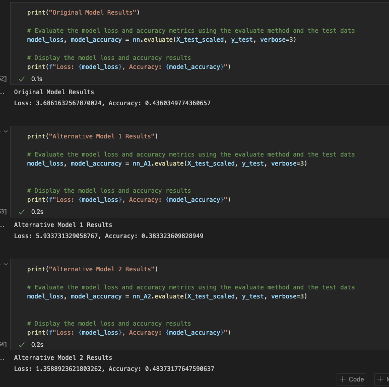

# Challenge13

## Overview
Create a neural network and two alternative nn models to predict if an Alphabetsoup, a VC, applicant will be a successful business.

## The models
Each neural network created has 116 input features and 1 output neuron.
The orginal and first alternative models have two hidden layers and use 50 epochs. The second alternative model has three hidden layers and uses 60 epochs. The original neural network's first and second hidden layers have 4 and 2 nodes, respectively. The first alternative neural network's first and second hidden layers have 12 and 6 nodes, respectively. The second alternative neural network's first, second, and third hidden layers have 20, 10, and 5 nodes, respectively.

## The Results
Here are the loss and accuracy scores of all three models

## Summary
The second alternative neural network generated the best accuracy (48%)